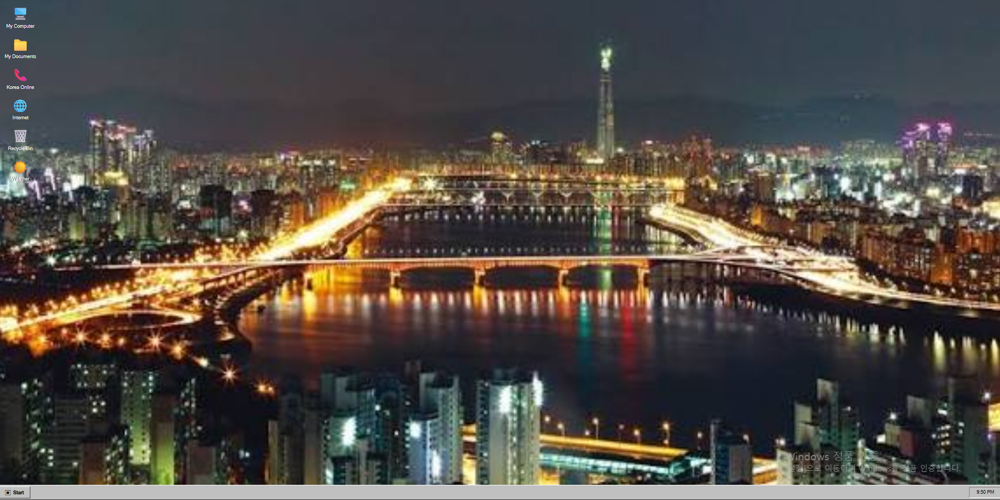
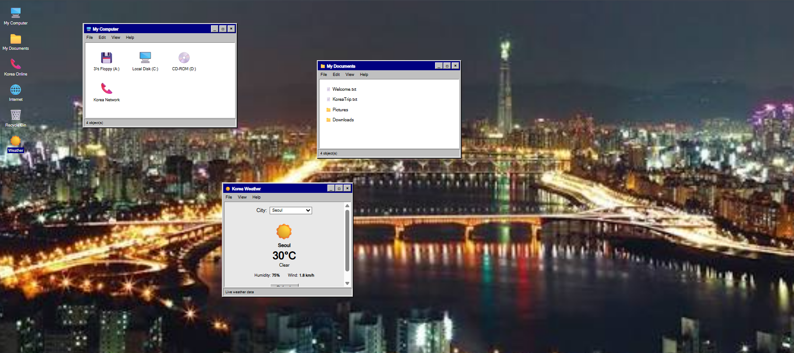
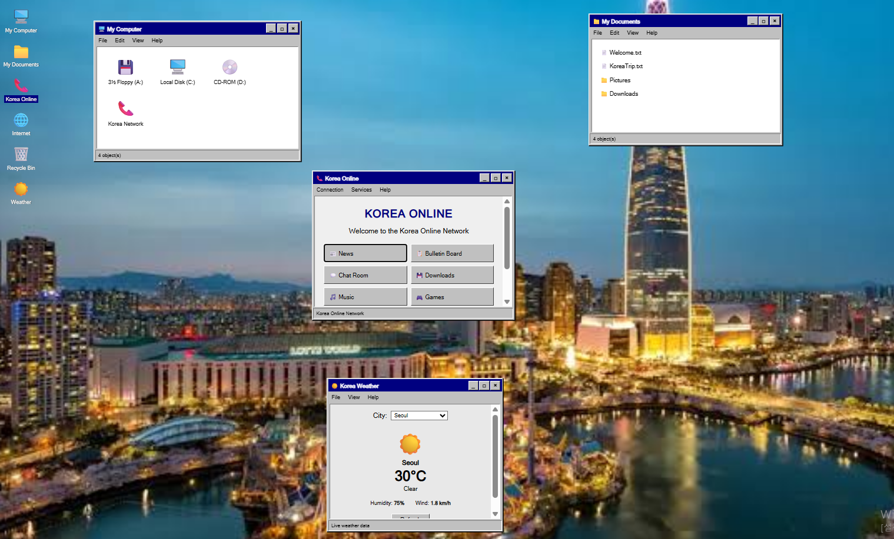
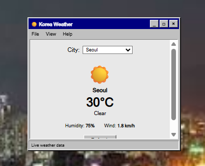
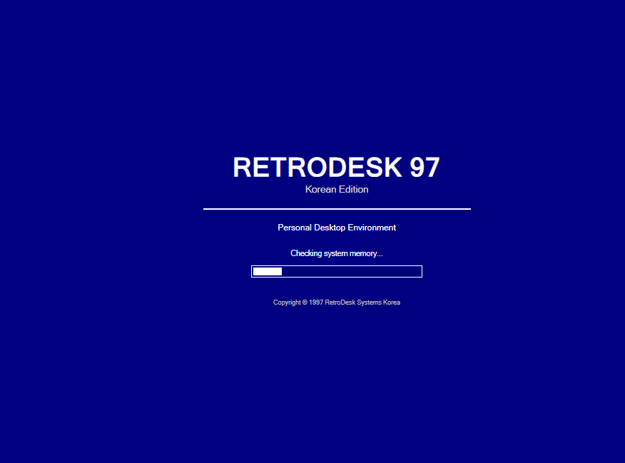

# RetroDesk 97

A retro web desktop inspired by late 1990s operating systems with a Korean theme.

**Live Demo:** https://d08835149-prog.github.io/RetroDesk-97/

Built with HTML, CSS, and JavaScript.



## Features

- Multiple draggable windows
- Start menu and taskbar
- Minimize, maximize, and close windows
- Korean city wallpapers
- Korea Online dial-up simulation
- Live weather using Open-Meteo
- Notepad and Calculator
- Recycle Bin
- Boot and shutdown screens

## Screenshots

### Desktop


### Multiple Windows



### Korea Online



### Weather



### Boot Screen



## Tech

- HTML
- CSS
- JavaScript
- Open-Meteo API

## Run Locally

```bash
git clone https://github.com/d08835149-prog/RetroDesk-97.git
cd RetroDesk97
```

Open the project using a local server such as VS Code Live Server.

## About

RetroDesk 97 is a fictional Korean desktop environment inspired by the look and feel of computers from the late 1990s.

No frameworks. Just HTML, CSS, and JavaScript.